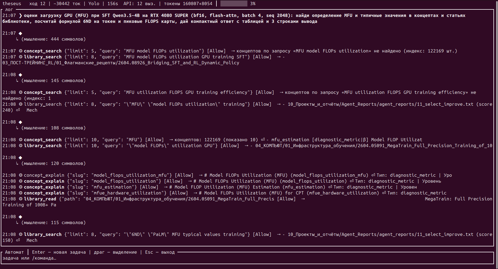
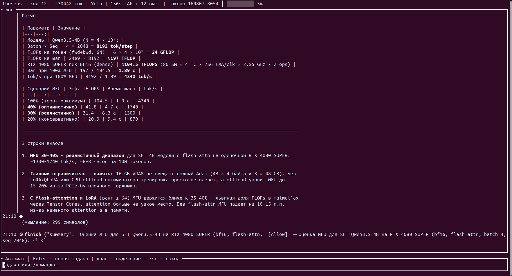
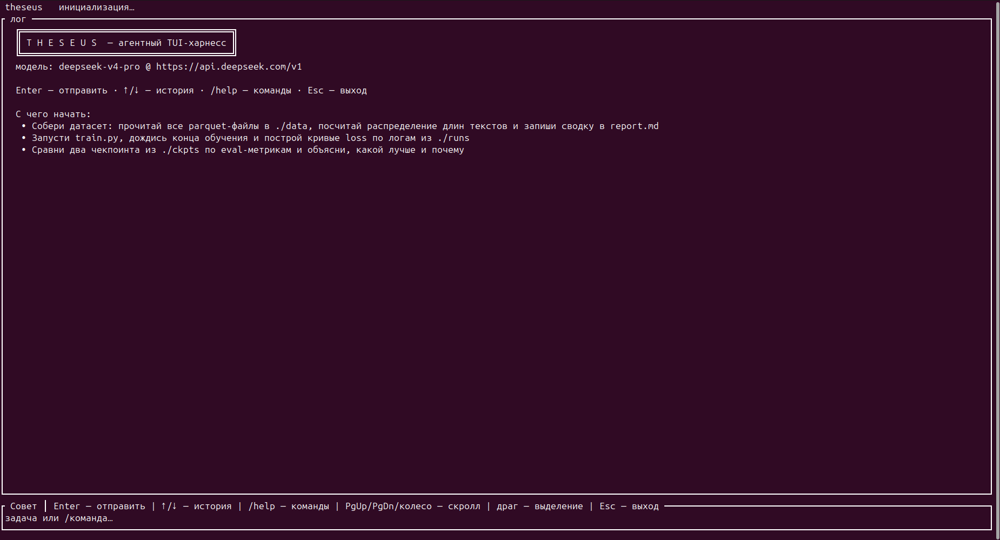

# Theseus (Тесей)

**Собственный агентный TUI-харнесс промышленного класса на Rust — создан за выходные Романом Некрасовым под свои интересы: LLM, RL и агентные системы.**

Тесей проходит лабиринт задач с нитью Ариадны — в роли нити здесь локальная
Qwen3.5-4B (GRPO), дообученная автором и работающая на домашнем GPU:
[huggingface.co/Rob1234567/qwen3.5-4b-ariadna-grpo-v1-gguf](https://huggingface.co/Rob1234567/qwen3.5-4b-ariadna-grpo-v1-gguf)







> **~53 900 строк Rust · 74 модуля · 28 инструментов агента · 1 304 зелёных теста ·
> 252 скилла · 122 169 карточек ML-концептов · 64 ГБ библиотеки статей ·
> 5 внешних агентов-партнёров · 0 предупреждений clippy**

---

## Почему это интересно

Тесей — не «ещё один чат-обёртка». Это полноценный агентный харнесс, построенный
после детального код-ревью трёх промышленных лидеров (Claude Code, OpenAI Codex,
xAI Grok Build — их архитектурные паттерны задокументированы в
[`docs/LEADERS_NOTES.md`](docs/LEADERS_NOTES.md)) — и **докрученный в сторону,
в которую лидеры не идут**: глубокая кастомизация под конкретного исследователя
ML/RL. Всё, что у лидеров зашито в код, здесь вынесено в конфиг, скиллы, темы,
провайдеры и peer-агенты.

## Тезис проекта: доменная кастомизация агентных харнессов — перспективное направление

Этот проект — рабочее доказательство тезиса: **агентный харнесс, заточенный под
домен, бьёт универсала на его же задачах**. Тесей доказывает это на живом домене
автора — исследовании LLM/RL:

- **Доменные инструменты важнее универсального промпта.** Универсальный агент
  начинает с нуля; Тесей сразу имеет 122k карточек концептов, 64 ГБ библиотеки
  статей, новостные дайджесты и HF-коллекции — как *инструменты с типизированным
  контрактом*, а не как «знания из весов». Ответ опирается на проверяемый
  источник (`path:line`), а не на память модели.
- **Доменные модели как тулы — стратегически верная архитектура.** Локальная
  Ариадна (Qwen3.5-4B GRPO) решает быстрые задачи (драфты, классификация,
  извлечение) бесплатно, за миллисекунды и офлайн — а тяжёлый резонинг уходит
  большой облачной модели. Харнесс сам маршрутизирует: что локально, что в облако.
- **Экономика и приватность.** Доменная сессия стоит копейки: 80% вызовов уходит
  локальной модели, облако — только там, где реально нужен фронтир. Приватные
  данные домена не покидают машину.
- **Харнесс — это ров.** Контекст, права, скиллы, память и тулинг, заточенные
  под домен, дают больше качества, чем +N параметров универсала.

**При этом большие проприетарные универсалы никуда не денутся** — они остаются
эталоном фронтир-резонинга и используются здесь как «тяжёлая артиллерия»
(DeepSeek V4-Pro — основная модель Тесея). Побеждает не замена, а **гибридный
инференс**: локальные доменные модели + облачные универсалы + агентные харнессы,
заточенные под домен, мирно живут в одном стеке — каждый на своём ярусе.

## Фичи

### Агентное ядро

- **Цикл агента со стримингом SSE**, мышлением (thinking), преемпцией по вводу
  пользователя (push-back, как mailbox у Codex) и отменой по Esc.
- **28 инструментов**: файлы (read/write/edit с 9-уровневым fuzzy-каскадом
  матчинга), apply_patch (Codex-формат), bash с ядерным sandbox (Landlock),
  фоновые задачи, веб-поиск/фетч с доменным allow-list, todo_write с гейтом
  finish, goal/plan-режимы с аудитом, и вся ML-линейка ниже.
- **Трёхуровневая автокомпактификация** (70% маскирование → 80% прунинг +
  семантический simhash-дедуп → 95% LLM-саммари) + триггер on-error
  «compact & resubmit».
- **Детекторы циклов**: doom-loop по fingerprint(tool,args), exploration spiral
  (5+ чтений подряд), повторы отказов — с лимитами напоминаний.
- **Права**: hard-deny regex → пользовательские правила → хуки → белый список →
  режимы «Совет» (спрашивать) / «Авто-правки» (полуавтомат) / «Автомат» (yolo);
  план-режим со schema gating.

### ML-специфика (этого нет у лидеров)

- **Библиотека концептов**: 122 169 карточек (`/home/roman/library`) —
  `concept_search` / `concept_explain` с графом related-связей.
- **Библиотека статей** (64 ГБ, recipes_taxonomy): `library_search` /
  `library_read` по arXiv-подборкам и отчётам.
- **Новостные дайджесты**: `digest_search` / `digest_read` по AINews, Raschka,
  Simon Willison и HF-дайджестам с фильтром «последние N дней».
- **HF-коллекции**: `hf_collections` — 302 коллекции 24 провайдеров (DeepSeek,
  Qwen, NVIDIA, Mistral…) с фильтром по провайдеру.
- **Субагент Ариадна**: локальная Qwen3.5-4B (GRPO, GGUF, llama.cpp на GPU;
  [модель на Hugging Face](https://huggingface.co/Rob1234567/qwen3.5-4b-ariadna-grpo-v1-gguf)) —
  быстрые задачи без расхода облачных токенов; авто-поднятие сервера,
  enable_thinking=false, страховка от runaway-thinking.

### Кастомизация (главный фокус)

- **Слоёный конфиг** (defaults < `~/.config/theseus/config.toml` <
  `<workspace>/.theseus/config.toml` < CLI) с валидацией: модель, лимиты,
  пороги компактификации, правила разрешений, хуки, MCP-серверы, домены,
  каталоги скиллов.
- **Скиллы пользователя**: 252 SKILL.md-пакета (рекурсивная разведка категорий,
  дедуп), прогрессивное раскрытие — дайджест в промпте + `skill_search` +
  `skill` для полного текста.
- **Темы TUI**: `/theme dark|light|mono` в рантайме, дизайн-токены ролей,
  WCAG-проверка контраста; свои темы — из TOML.
- **Хуки жизненного цикла**: 8 событий (PreToolUse, PostToolUse, PreCompact,
  PostCompact, SessionStart, SessionEnd, Notification, GoalSet), shell-команды,
  exit 2 = блок, параллельное исполнение.
- **Peer-агенты**: мост к установленным CLI-агентам (`peer_ask`): Claude Code,
  Kimi Code, CodeWhale, Hermes Agent, OpenClaw — с правовым гейтом
  (DontAsk→DENY, Ask→попап, Yolo→Allow) и `/peers`-таблицей статуса.
- **Раскладка клавиш и keymap из TOML**, история ввода, автодополнение
  slash-команд по Tab (общий префикс + цикл кандидатов).
- **Провайдеры моделей**: реестр (deepseek / kimi / moonshot /
  openai-compatible) с подсказками при опечатках; wire-уровень OpenAI Chat.

### TUI (современный)

Markdown-рендер ответов (заголовки/код/списки/ссылки), блочный лог с желобком
(время один раз на блок, разделители-«воздух» между блоками), **компактный
трейс инструментов в одну строку** (вызов `→` результат, как у лидеров —
трейс не уходит вниз, скролл не нужен), welcome-экран со стартовыми промптами,
спиннер «работаю…» + строка «думаю…», контекст-бар заполнения окна,
slash-completion над вводом (голый `/` — весь список из 19 команд с адаптивной
обрезкой) и автодополнение по Tab, история `↑/↓` с черновиком,
git-статус в заголовке, колесо мыши + PgUp/PgDn, выделение мышью в буфер
обмена, попап разрешений, индикатор режима в заголовке ввода
(Совет/Авто-правки/Автомат). Весь вывод в терминал проходит санитацию
управляющих символов (C0/C1 → видимые маркеры): вывод `pdftotext` с form feed
или бинарный мусор не ломает отрисовку кадра.

### Сессии

`/new` и `/clear` создают **полноценную новую сессию**, а не просто чистят экран:
новая метка времени, новые файлы транскрипта (`events-*.jsonl`, `trace-*.jsonl`,
`session-*.json` — старые сохраняются для аудита), сброс пер-сессионных
детекторов циклов и todo-списка. Сессии образуют resume-дерево с fork.

### Наблюдаемость и качество

- **Трейсинг**: спаны turn/api_call/tool_exec/compact → chrome-trace +
  jsonl-поток; метрики (counter/gauge/histogram) с Prometheus-экспортом.
- **Транскрипты**: session-*.json + events-*.jsonl, resume-дерево сессий с fork.
- **Доктор**: `theseus doctor [--fix]` — 11+ проверок окружения с автофиксами.
- **Тесты**: 1 291 unit/integration (включая мок SSE-сервер и бинарные e2e) +
  13 doctests + 22 живых теста DeepSeek + criterion-бенчмарки.

## Статистика

| Метрика | Значение |
|---|---|
| Строк Rust (src/) | **51 768** |
| Строк всего (+tests/+benches) | **~53 900** |
| Модулей | 74 |
| Инструментов агента | 28 |
| Unit/integration тестов | 1 291 (все зелёные) |
| Doctests | 13 |
| Живых тестов DeepSeek V4-Pro | 22 (`--ignored`) |
| Clippy | **0 предупреждений** (deny-список в стиле codex-rs) |
| Скиллов в библиотеке | 252 |
| Карточек концептов | 122 169 |
| Библиотека статей | 64 ГБ (14.7k PDF + 2.9k docx) |
| Peer-агентов | 5 |
| Проверок doctor | 11+ |
| Размер release-бинарника | ~11,0 МБ |
| MSRV | Rust 1.85 |

## Быстрый старт

```bash
export DEEPSEEK_API_KEY=...
cargo build --release

./target/release/theseus                          # TUI
./target/release/theseus -w ~/proj "задача"       # TUI с первой задачей
./target/release/theseus --yolo -w ~/proj -p "задача"  # headless для CI
./target/release/theseus doctor                   # диагностика окружения
```

В TUI: `Enter` — отправить, `Tab` — автодополнение команд, `/help` — 19 команд,
`/` — весь список команд, `/new` — новая сессия, `/theme` — темы, `Esc` —
прервать/выйти, колесо мыши — прокрутка, драг — выделение в буфер обмена.

## Архитектура (карта)

Паттерн «core as lib, cli as thin bin»: вся логика в `lib.rs` (70 модулей),
`main.rs` — только парсинг аргументов. Ключевые узлы: `agent/` (цикл, события,
компактификация, исполнение, детекторы), `tools.rs` (28 инструментов),
`permissions.rs` + `execpolicy.rs` (двухпроходные решения), `sandbox.rs`
(Landlock) + `sandbox_bwrap.rs`, `mcp.rs`/`mcp_ext.rs`/`acp.rs`, `prompts.rs`,
`session.rs`, `trace.rs` + `telemetry.rs`, `ml_concepts.rs` + `library.rs` +
`digests.rs` + `ariadna.rs` + `peers.rs` (ML-линейка), `tui.rs` + `theme.rs` +
`markdown.rs` + `keymap.rs` + `slash.rs` + `history.rs`.

## Честные ограничения

- Ядерный sandbox — Landlock (bubblewrap-план есть, но на Ubuntu 24.04+ с
  AppArmor-запретом userns падает обратно на Landlock — как и задумано fallback'ом).
- MCP — stdio + HTTP (bearer/elicit), без OAuth.
- Провайдер по умолчанию — DeepSeek V4-Pro; остальные — через реестр моделей.

## Лицензия

MIT OR Apache-2.0
