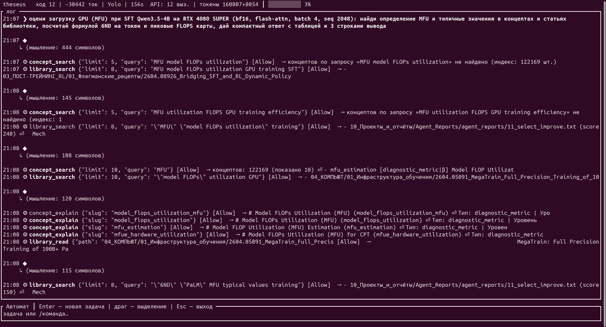
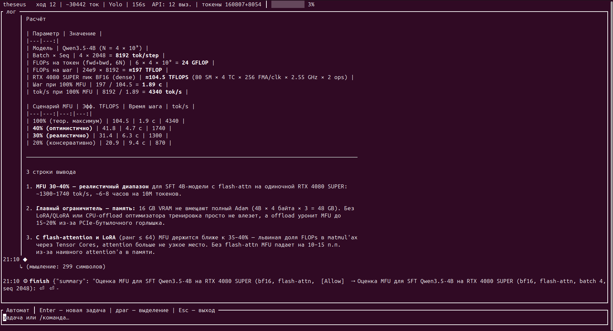
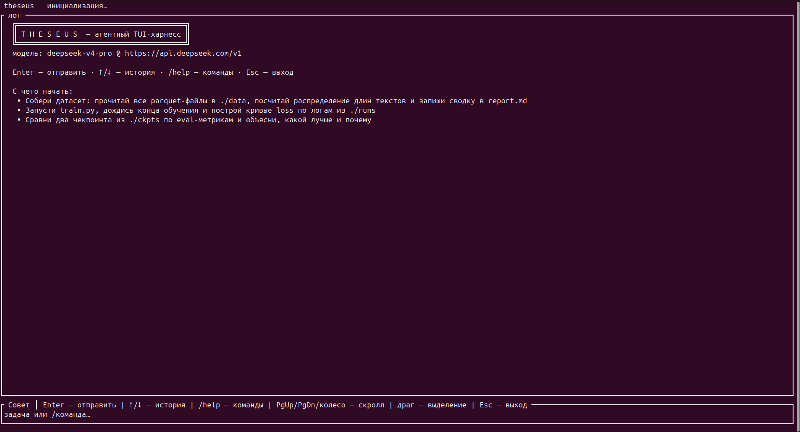

# Theseus (Тесей)

[](https://github.com/romannekrasovaillm/theseus/actions/workflows/ci.yml)

**Собственный агентный TUI-харнесс промышленного класса на Rust — создан за выходные Романом Некрасовым под свои интересы: LLM, RL и агентные системы.**

Тесей проходит лабиринт задач с нитью Ариадны — в роли нити здесь локальная
Qwen3.5-4B (GRPO), дообученная автором и работающая на домашнем GPU:
[huggingface.co/Rob1234567/qwen3.5-4b-ariadna-grpo-v1-gguf](https://huggingface.co/Rob1234567/qwen3.5-4b-ariadna-grpo-v1-gguf)







> **~57 000 строк Rust · 74 модуля · 31 инструмент агента · 1 367 зелёных тестов ·
> 981 скилл (1093 SKILL.md-файла) · ~124,5 тыс. карточек ML-концептов ·
> 6 ГБ библиотеки статей · 5 внешних агентов-партнёров · 0 предупреждений clippy**

---

## Установка и запуск

```bash
cargo build --release          # сборка (~20 с на тёплом кэше)
./target/release/theseus       # запуск из каталога репозитория
```

Для запуска из любого каталога простой командой `theseus` — симлинк в PATH
(после каждой пересборки команда сразу использует свежий бинарь):

```bash
ln -sfn "$PWD/target/release/theseus" ~/.local/bin/theseus
theseus                  # TUI
theseus doctor           # диагностика окружения
theseus-max              # TUI в режиме максимальных прав (--max)
```

Требуется ключ DeepSeek (`DEEPSEEK_API_KEY` в окружении; для GLM-5.2 —
`ZHIPU_API_KEY`, принимаются также `GLM_API_KEY`/`ZAI_API_KEY`). Конфиг —
`~/.config/theseus/config.toml` (необязателен: дефолты разумные).

---

## Почему это интересно

Тесей — не «ещё один чат-обёртка». Это полноценный агентный харнесс, построенный
после детального код-ревью трёх промышленных лидеров (Claude Code, OpenAI Codex,
xAI Grok Build — их архитектурные паттерны задокументированы в
[`docs/LEADERS_NOTES.md`](docs/LEADERS_NOTES.md)) — и **докрученный в сторону,
в которую лидеры не идут**: глубокая кастомизация под конкретного исследователя
ML/RL. Всё, что у лидеров зашито в код, здесь вынесено в конфиг, скиллы, темы,
провайдеры и peer-агенты.

## Тезис проекта: доменная кастомизация агентных харнессов — перспективное направление

Этот проект — рабочее доказательство тезиса: **агентный харнесс, заточенный под
домен, бьёт универсала на его же задачах**. Тесей доказывает это на живом домене
автора — исследовании LLM/RL:

- **Доменные инструменты важнее универсального промпта.** Универсальный агент
  начинает с нуля; Тесей сразу имеет 122k карточек концептов, 6 ГБ библиотеки
  статей, новостные дайджесты и HF-коллекции — как *инструменты с типизированным
  контрактом*, а не как «знания из весов». Ответ опирается на проверяемый
  источник (`path:line`), а не на память модели.
- **Доменные модели как тулы — стратегически верная архитектура.** Локальная
  Ариадна (Qwen3.5-4B GRPO) решает быстрые задачи (драфты, классификация,
  извлечение) бесплатно, за миллисекунды и офлайн — а тяжёлый резонинг уходит
  большой облачной модели. Харнесс сам маршрутизирует: что локально, что в облако.
- **Экономика и приватность.** Доменная сессия стоит копейки: облако — только
  там, где реально нужен фронтир. Приватные данные домена не покидают машину.
- **Харнесс — это ров.** Контекст, права, скиллы, память и тулинг, заточенные
  под домен, дают больше качества, чем +N параметров универсала.

**При этом большие проприетарные универсалы никуда не денутся** — они остаются
эталоном фронтир-ризонинга и используются здесь как «тяжёлая артиллерия»
(по умолчанию — DeepSeek V4 Flash; фронтир-ризонинг — V4 Pro, GLM-5.2 и
Kimi K3, переключаются на лету командой `/model`). Побеждает не замена, а
**гибридный инференс**: локальные доменные модели + облачные универсалы +
агентные харнессы, заточенные под домен, мирно живут в одном стеке — каждый
на своём ярусе.

## Фичи

### Агентное ядро

- **Цикл агента со стримингом SSE**, мышлением (thinking), преемпцией по вводу
  пользователя (push-back, как mailbox у Codex) и отменой по Esc.
- **31 инструмент**: файлы (read/write/edit с 9-уровневым fuzzy-каскадом
  матчинга), apply_patch (Codex-формат), bash с ядерным sandbox (Landlock),
  фоновые задачи, веб-поиск/фетч с доменным allow-list, todo_write с гейтом
  finish, goal/plan-режимы с аудитом, и вся ML-линейка ниже.
- **Трёхуровневая автокомпактификация** (стадия 0 — маскирование
  переразмерных tool-сообщений в любой позиции; 70% маскирование старых →
  80% прунинг + семантический simhash-дедуп → 95% LLM-саммари) + триггер
  on-error «compact & resubmit» (включая HTTP 413 Request Entity Too Large).
- **Детекторы циклов**: doom-loop по fingerprint(tool,args), exploration spiral
  (5+ чтений подряд), повторы отказов — с лимитами напоминаний.
- **Права — 4 режима**: «Совет» (спрашивать) / «Авто-правки» (полуавтомат) /
  «Автомат» (yolo) / **«Максимум»** (`/mode max`, `--max`, `theseus-max` —
  hard-deny, confinement на workspace, .git-защита и ядерный sandbox off;
  красный бейдж в TUI). Слои: hard-deny regex → пользовательские правила →
  хуки → белый список → режим; план-режим со schema gating.
- **Выбор модели на лету** (`/model`): пикер из четырёх — DeepSeek V4 Flash
  (по умолчанию), V4 Pro (фронтир-ризонинг), GLM-5.2 (Zhipu), Kimi K3
  (Kimi Code, id `k3`); переключение на границе хода, субагенты следуют за
  главной моделью. Для kimi thinking extra_body сбрасывается автоматически
  (Kimi Code требует reasoning_content в истории при thinking=enabled).

### ML-специфика (этого нет у лидеров)

- **Библиотека концептов**: ~124,5 тыс. карточек (`/home/roman/library`) —
  `concept_search` / `concept_explain` с графом related-связей. Индекс
  переиндексируется сам: `concept_reindex` принудительно + TTL-проверка
  (дешёвый отпечаток каталога раз в 5 минут) — новые карточки подхватываются
  без перезапуска агента.
- **Библиотека статей** (6 ГБ, recipes_taxonomy): `library_search` /
  `library_read` по arXiv-подборкам и отчётам.
- **Новостные дайджесты**: `digest_search` / `digest_read` по AINews, Raschka,
  Simon Willison и HF-дайджестам с фильтром «последние N дней».
- **HF-коллекции**: `hf_collections` — 302 коллекции 24 провайдеров (DeepSeek,
  Qwen, NVIDIA, Mistral…) с фильтром по провайдеру.
- **Субагент Ариадна**: локальная Qwen3.5-4B (GRPO, GGUF, llama.cpp на GPU;
  [модель на Hugging Face](https://huggingface.co/Rob1234567/qwen3.5-4b-ariadna-grpo-v1-gguf)) —
  быстрые задачи без расхода облачных токенов; авто-поднятие сервера,
  enable_thinking=false, страховка от runaway-thinking.
- **Веб-поиск v2**: первичный источник — DuckDuckGo Lite (полноценные
  результаты со сниппетами, устойчив к бот-фильтрам), дополнение — DDG
  Instant Answer + Wikipedia OpenSearch EN/RU.

### Кастомизация (главный фокус)

- **Слоёный конфиг** (defaults < `~/.config/theseus/config.toml` <
  `<workspace>/.theseus/config.toml` < CLI) с валидацией: модель, лимиты,
  пороги компактификации, правила разрешений, хуки, MCP-серверы, домены,
  каталоги скиллов.
- **Скиллы пользователя**: 363 SKILL.md-пакета (343 уникальных имени,
  рекурсивная разведка категорий, дедуп), прогрессивное раскрытие — дайджест
  в промпте + `skill_search` + `skill` для полного текста.
- **Интеллектуальный поиск скиллов** (`/skill-search`, алиас `/sfind`) —
  второй, смысловой контур поверх встроенного `skill_search`: гибрид
  BM25 по полям (имя/теги/описание, веса 3:2:2) + локальные мультиязычные
  эмбеддинги (paraphrase-multilingual-MiniLM на CPU, свой venv), объединение
  топ-15 обоих каналов в кандидатный набор для LLM-реранка (recall 0.98,
  fused hit@1 0.70 против 0.52 у чистой лексики — замерено на эталонном
  наборе из 50 запросов по живой библиотеке). Все кандидаты показываются
  на экране с рангами каналов; пронумерованный список автоматически
  передаётся агенту в контекст, поэтому «загрузи скилл N» резолвится по
  экранной нумерации. Плюс `--audit` здоровья библиотеки (дубли имён,
  пустые описания, скиллы без тегов) и журнал запросов для пополнения
  эталонного набора.
- **Темы TUI**: `/theme dark|light|mono` в рантайме, дизайн-токены ролей,
  WCAG-проверка контраста; свои темы — из TOML.
- **Хуки жизненного цикла**: 8 событий (PreToolUse, PostToolUse, PreCompact,
  PostCompact, SessionStart, SessionEnd, Notification, GoalSet), shell-команды,
  exit 2 = блок, параллельное исполнение.
- **Peer-агенты**: мост к установленным CLI-агентам (`peer_ask`): Claude Code,
  Kimi Code, CodeWhale, Hermes Agent, OpenClaw — с гейтом разрешений
  (DontAsk→DENY, Ask→попап, Yolo→Allow) и `/peers`-таблицей статуса.
  **Нативный стриминг claude/kimi** (stream-json, без брокеров): текст и
  вызовы инструментов пира видны в логе живьём блоком «◈ имя»; остальные —
  синхронный захват (их режимы отдают только финал). Фоновые пиры будят
  агента по завершении (заметка в промпт), а в `/bg` видна последняя строка
  вывода каждого («жив ли пир»). A2A-паттерн кросс-ревью: результат одного
  пира — контекстом задачи другого.
- **Раскладка клавиш и keymap из TOML**, история ввода, автодополнение
  slash-команд по Tab (общий префикс + цикл кандидатов).
- **Провайдеры моделей**: реестр (deepseek / kimi / moonshot / zhipu /
  openai-compatible) с подсказками при опечатках; wire-уровень OpenAI Chat.
  По умолчанию — DeepSeek V4 Flash; `/model` — пикер из четырёх (V4 Flash,
  V4 Pro, GLM-5.2, Kimi K3) с переключением на границе хода. Kimi — через
  официальную coding-поверхность `api.kimi.com/coding/v1` (id `k3`).
  Env-ключи провайдеров с алиасами (`ZHIPU_API_KEY` | `GLM_API_KEY` | `ZAI_API_KEY`).

### Кейс: коллективное ревью агентов и помощь OpenClaw

Живой пример оркестровки (июль 2026): у соседнего агента OpenClaw случился
процессный сбой — cron ходил за дайджестами в RSS, хотя важное письмо
отраслевого эксперта лежало в Gmail (подписку переключили, а навык и
fetch-скрипт не обновили).
Тесей собрал контекст инцидента и **вызвал коллектив агентов на независимое
ревью в фоне** (`peer_ask is_background`):

- **Claude Code**: «Это не оправдание — это признание системного провала» —
  нет атомарности изменений (подписка обновлена, downstream нет), нет
  health-check'а (cron молча отработал с пустым результатом), культура
  «доделаю потом».
- **CodeWhale**: «Болен весь процесс управления конфигурацией» — источник
  захардкожен в двух местах, нет аудита целостности, нет алертинга.

Консолидированный вердикт Тесея: **баг процесса, а не агента — лечить
архитектурой, не патчем**. После чего Тесей передал разбор и слово OpenClaw —
на исправление.

Паттерн: харнесс как оркестратор — основной цикл собирает контекст, фоновые
peer-агенты выдают независимые вердикты **параллельно**, Тесей консолидирует
и маршрутизирует исправление. Основная работа при этом не блокируется:
пиры трудились в фоне, а индикатор «фон: N» в шапке показывал их статус.

### Кейс: тестирование субагентов и пир-агентов (стресс-прогон 24.07.2026)

Живая проверка оркестровки: сначала Тесей прогнал hello-задачи через **все
типы субагентов и всех пиров**, затем — стресс-тест роем фоновых субагентов
с наращиванием 16 → 32 → 64 → 128.

**Типы субагентов (инструмент `task` / рой `swarm`).** 4 встроенных типа,
изолированный контекст, свои бюджеты; readonly-типы без гейтов разрешений,
`test_runner` (bash) — с гейтом по режиму:

| Тип | Роль | Тулсет | Бюджет (ходы/токены/сек) |
|---|---|---|---|
| `explore` | Разведка по коду и базе знаний, ответы со ссылками | read/grep + library/digest/hf/concept/web (readonly) | 25 / 500K / 900 |
| `plan` | Архитектурный план с проверяемыми шагами | read/grep + web (readonly) | 25 / 500K / 900 |
| `code_review` | Ревью diff'а, находки по severity | read/grep (readonly) | 15 / 300K / 600 |
| `test_runner` | Прогон сборки/тестов/линтов, честный отчёт | bash (не-мутирующие команды) | 30 / 400K / 900 |

**Пир-агенты (`peer_ask`).** Все 5 внешних CLI-агентов подтверждены рабочими
(hello-прогон 24.07, ответы за 10–13 с): claude (300 с), kimi (600 с —
ресёрч-задачи идут минуты), codewhale (300 с), hermes (600 с), openclaw
(180 с; Тесей сам подбирает поддерживаемую версию Node.js из nvm —
см. живой кейс в коммитах).

**Стресс-тест роем** (`swarm` + `swarm_wait`, фоновые explore-задачи):

| Запущено | Результат | Время на задачу | Волны | Вывод |
|---|---|---|---|---|
| 16 | ✅ 16/16 | 4 с | 1 | мгновенно |
| 32 | ✅ 32/32 | 3 с | 1 | всё ещё без очереди |
| 64 | ✅ 64/64 | 24 с / 3 с | 2 | упёрлись в ~32 слота |
| 128 | ✅ 128/128 | 67 с / 46 с / 26 с / 5 с | 4 | лимит подтверждён |

**Ключевой вывод: конкурентный лимит раннера — ~32 одновременных слота.**
До 32 задачи идут параллельно (~3–5 с каждая); свыше — честная очередь
волнами ~20 с (5 с работы + накладные). 128 субагентов отработали за ~67 с
суммарно, **0 отказов**. Практический потолок без деградации — 32
параллельных субагента; больше можно, с линейным ростом задержки
`N/32 × ~20 с`. За всем этим в TUI следили живая панель «фон» и
уведомления о завершении — рой не требовал ни одного ручного опроса.

### TUI (современный)

Markdown-рендер ответов (заголовки/код/списки/ссылки), блочный лог с желобком
(время один раз на блок, разделители-«воздух» между блоками), **компактный
трейс инструментов в одну строку** (вызов `→` результат, как у лидеров —
трейс не уходит вниз, скролл не нужен), **peer-блоки «◈ имя»** (нативный
стриминг claude/kimi: текст и инструменты пира живьём, хронология не путается),
welcome-экран со стартовыми промптами, спиннер «работаю…» + строка «думаю…»,
контекст-бар заполнения окна, slash-completion над вводом (голый `/` — весь
список из 22 команд с адаптивной обрезкой) и автодополнение по Tab, история
`↑/↓` с черновиком, git-статус в заголовке, колесо мыши + PgUp/PgDn, выделение
мышью в буфер обмена, бейдж «▼ в самое низ», попап разрешений, индикатор
режима в заголовке ввода (Совет/Авто-правки/Автомат/Максимум — красным).
Панель «фон: N» + `/bg` с хвостом вывода каждой фоновой задачи. Весь вывод в
терминал проходит двойную санитацию: ANSI-последовательности срезаются
целиком (полный автомат: CSI/OSC/C1, недописанные хвосты отбрасываются),
управляющие символы → видимые маркеры — ни цветной вывод инструментов, ни
form feed из `pdftotext` не ломают кадр.

### Сессии

`/new` и `/clear` создают **полноценную новую сессию**, а не просто чистят экран:
новая метка времени, новые файлы транскрипта (`events-*.jsonl`, `trace-*.jsonl`,
`session-*.json` — старые сохраняются для аудита), сброс пер-сессионных
детекторов циклов и todo-списка. Сессии образуют resume-дерево с fork.
**Пикер прежних сессий** (`/sessions`): карточки с датой, заголовком (первая
user-реплика) и первыми строками; **`/resume N`** поднимает выбранную сессию
прямо в TUI (история в контексте, хвост последних реплик в логе).

### Наблюдаемость и качество

- **Трейсинг**: спаны turn/api_call/tool_exec/compact → chrome-trace +
  jsonl-поток; метрики (counter/gauge/histogram) с Prometheus-экспортом.
- **Транскрипты**: session-*.json + events-*.jsonl, resume-дерево сессий с fork.
- **Доктор**: `theseus doctor [--fix]` — 11+ проверок окружения с автофиксами.
- **Тесты**: 1 367 unit/integration (включая мок SSE-сервер, мок-стрим пиров и
  бинарные e2e) + 13 doctests + 22 живых теста DeepSeek + criterion-бенчмарки.

## Статистика

| Метрика | Значение |
|---|---|
| Строк Rust (src/) | **57 037** |
| Модулей | 74 |
| Инструментов агента | 31 |
| Unit/integration тестов | 1 367 (все зелёные) |
| Doctests | 13 |
| Живых тестов DeepSeek | 22 (`--ignored`) |
| Clippy | **0 предупреждений** (deny-список в стиле codex-rs) |
| Скиллов в библиотеке | 981 уникальных (1093 SKILL.md-файла) |
| Карточек концептов | ~124,5 тыс. (290 тыс. с алиасами) |
| Библиотека статей | 6 ГБ (14.7k PDF + 2.9k docx) |
| Peer-агентов | 5 (2 с нативным стримингом) |
| Проверок doctor | 11+ |
| Размер release-бинарника | ~11,0 МБ |
| MSRV | Rust 1.85 |

## Быстрый старт

```bash
export DEEPSEEK_API_KEY=...
cargo build --release

./target/release/theseus                          # TUI
./target/release/theseus -w ~/proj "задача"       # TUI с первой задачей
./target/release/theseus --yolo -w ~/proj -p "задача"  # headless для CI
./target/release/theseus doctor                   # диагностика окружения
```

В TUI: `Enter` — отправить, `Tab` — автодополнение команд, `/help` — 22 команды,
`/` — весь список команд, `/new` — новая сессия, `/sessions` — пикер прежних
сессий (`/resume N` — загрузка в TUI), `/model` — выбор модели из трёх,
`/mode max` — максимальные права, `/skill-search` — умный поиск скиллов,
`/theme` — темы, `Esc` — прервать/выйти, колесо мыши — прокрутка,
драг — выделение в буфер обмена.

## Архитектура (карта)

```
┌───────────────────────────────────────────────────────────────────────────┐
│                              ПОЛЬЗОВАТЕЛЬ                                 │
└─────────────────────────────────────▼─────────────────────────────────────┘
┌───────────────────────────────────────────────────────────────────────────┐
│ TUI (ratatui)              tui.rs · theme.rs · slash.rs · markdown.rs     │
│ markdown-лог · peer-блоки «◈» · /bg+хвост · /sessions · /model · /mode    │
└─────────────────────────────────────▼─────────────────────────────────────┘
┌───────────────────────────────────────────────────────────────────────────┐
│ АГЕНТНЫЙ ЦИКЛ           agent/mod.rs · execute.rs · compact.rs            │
│ промпт → LLM → tool calls → результат → LLM → … → finish                  │
│ детекторы doom/spiral · компакт. L0/L1/L2/L3 · 413-триггер · трасса       │
└───────────────────────────────────────────────────────────────────────────┘
├───────────────────────────────────────────────────────────────────────────┤
│ ГЕЙТ РАЗРЕШЕНИЙ: permissions.rs + execpolicy.rs · sandbox (Landlock)      │
│ 4 режима: Совет · Авто-правки · Автомат · Максимум (--max, /mode max)     │
└─────────┬──────────────────────┬──────────────────────┬───────────────────┘
┌────────────────────┐   ┌───────────────────────┐   ┌──────────────────────┐
│ 31 ИНСТРУМЕНТ      │   │ СУБАГЕНТЫ (task)      │   │ BgRegistry +         │
│ tools.rs           │   │ explore · plan ·      │   │ watcher              │
│ файлы · bash · web │   │ code_review ·         │   │ background.rs        │
│ память · скиллы ·  │   │ test_runner           │   │ хвост вывода +       │
│ патчи · MCP · ACP  │   │ РОЙ до 8 (swarm)      │   │ будильник агента     │
└────────────────────┘   └───────────────────────┘   └──────────────────────┘
┌───────────────────────────────────────────────────────────────────────────┐
│ СЛОЙ ЗНАНИЙ: library.rs · digests.rs · ml_concepts.rs · skills.rs ·       │
│ tools.rs · статьи 6 ГБ · дайджесты · 124K карточек + TTL-реиндекс ·       │
│ 981 скилл (BM25 + эмбеддинги) · веб-поиск: DDG Lite + Wiki EN/RU          │
└─────────┬──────────────────────┬──────────────────────┬───────────────────┘
┌────────────────────┐   ┌───────────────────────┐   ┌──────────────────────┐
│ МОДЕЛИ (/model)    │   │ АРИАДНА (local)       │   │ ПИРЫ — 5 CLI         │
│ DeepSeek V4 Flash  │   │ Qwen3.5-4B GRPO       │   │ claude·kimi:         │
│ (дефолт) · V4 Pro  │   │ llama.cpp, GPU        │   │ стриминг stream-json │
│ · GLM-5.2 · Kimi K3│   │ RU, fallback EN       │   │ (нативно, «◈»)       │
│ реестр провайдеров │   │                       │   │ codewhale·hermes·    │
│ + env-алиасы ключей│   │                       │   │ openclaw: sync       │
└────────────────────┘   └───────────────────────┘   └──────────────────────┘
```

Паттерн «core as lib, cli as thin bin»: вся логика в `lib.rs` (74 модуля),
`main.rs` — только парсинг аргументов. Ключевые узлы: `agent/` (цикл, события,
компактификация, исполнение, детекторы), `tools.rs` (31 инструмент),
`permissions.rs` + `execpolicy.rs` (двухпроходные решения), `sandbox.rs`
(Landlock) + `sandbox_bwrap.rs`, `mcp.rs`/`mcp_ext.rs`/`acp.rs`, `prompts.rs`,
`session.rs`, `trace.rs` + `telemetry.rs`, `ml_concepts.rs` + `library.rs` +
`digests.rs` + `ariadna.rs` + `peers.rs` + `background.rs` (ML-линейка и
оркестровка), `models.rs` (реестр провайдеров), `tui.rs` + `theme.rs` +
`markdown.rs` + `keymap.rs` + `slash.rs` + `history.rs`.

## Честные ограничения

- Ядерный sandbox — Landlock (bubblewrap-план есть, но на Ubuntu 24.04+ с
  AppArmor-запретом userns падает обратно на Landlock — как и задумано fallback'ом).
- MCP — stdio + HTTP (bearer/elicit), без OAuth.
- Провайдер по умолчанию — DeepSeek V4 Flash; V4 Pro, GLM-5.2 и Kimi K3 —
  через `/model` (быстрый выбор из четырёх, переключение на границе хода).
- Стриминг пиров нативный только для claude/kimi (stream-json): codewhale/
  hermes/openclaw отдают только финальный ответ — их headless-режимы печатают
  финал одной пачкой (см. скилл peer-sse-streaming и его тест-отчёты).

## Лицензия

MIT OR Apache-2.0
